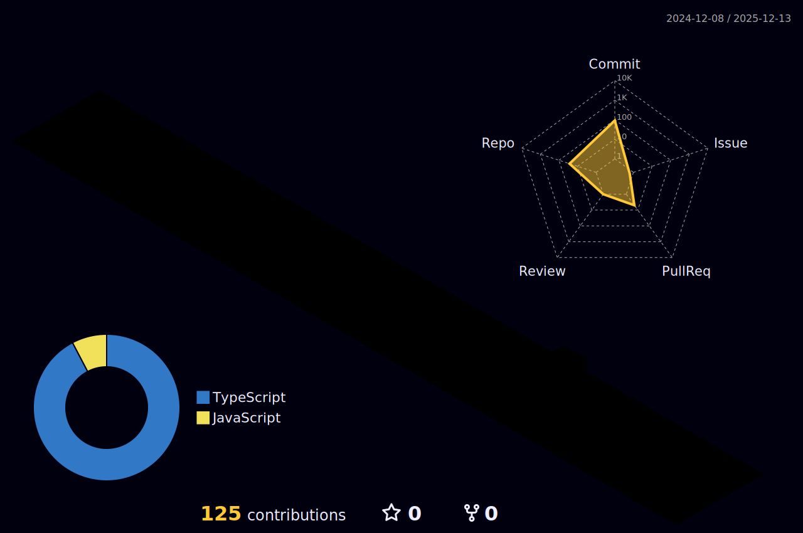

  

  
  
  

---

## About Me

Data Engineer specializing in **real-time data pipelines** and **autonomous AI systems**. I transform raw data into actionable intelligence through scalable architectures and intuitive analytics interfaces.

Currently pursuing my Master's at **San Jose State University**, building systems that handle streaming market data, sports analytics, and supply chain optimization.

- 🔭 Working on: **Real-time data pipelines & streaming architectures**
- 🌱 Learning: **MLOps, LLM orchestration, and distributed systems**
- 💬 Ask me about: **Kafka, Airflow, Python, Data Engineering, SQL optimization**

---

## Featured Projects

### Stock Data Platform
> **Batch + Streaming platform for market analytics**

  

- Unified real-time ticks and batch OHLC data into single query-friendly warehouse
- Kafka topics for near-real-time ingestion with idempotent writes
- Airflow orchestration for batch ingests, backfills, and dimensional loads
- Interactive dashboards with SMA/EMA indicators and intraday heatmaps

---

### La Liga Live
> **Real-time match analytics with xG, heatmaps, formations**

  

- Real-time xG curves, shot maps, possession/pressing zones
- Live event feed processing with latency-optimized charts
- One-screen view of game state for faster tactical insights

---

## Research & Publications

### IEEE Xplore Publications

| Paper | Topic | Year |
|-------|-------|------|
| **Stacking Ensemble for Diabetes Prediction** | ML ensemble achieving 82.68% accuracy on health data | AIMV-21 |
| **Efficient Vaccine Scheduler** | CPU-scheduling-inspired prioritization framework | AIMV-21 |

---

## GitHub Activity

### Trophy Case

  

### Stats & Streak

  
  

### Activity Graph

  

### Top Languages

  

### Contribution Snake

  

### 3D Contribution Graph

  

---

  

